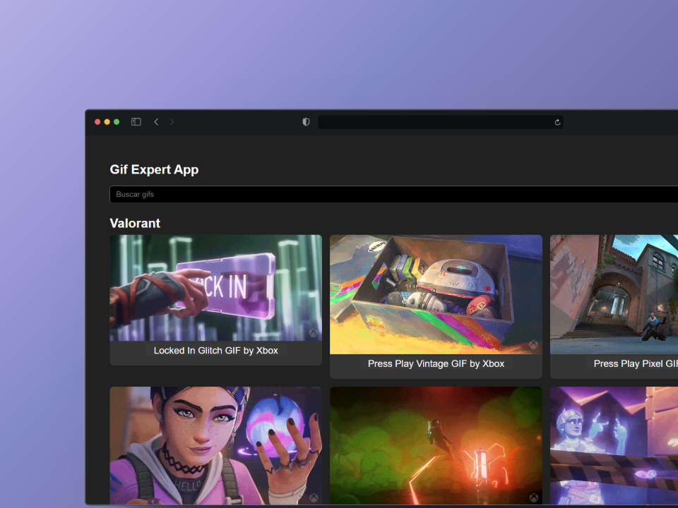

# Gif Expert App

## Descripción

Gif Expert App es una aplicación web que permite buscar GIFs utilizando la API de Giphy ([Giphy Developers](https://developers.giphy.com/)). Este proyecto fue desarrollado con el propósito de practicar React y el consumo de APIs externas.

## Características

- Búsqueda dinámica de GIFs.
- Integración con la API de Giphy.
- Listado de resultados con imágenes animadas.
- Diseño sencillo y responsivo.

## Tecnologías utilizadas

- React
- Vite
- Fetch API
- CSS
